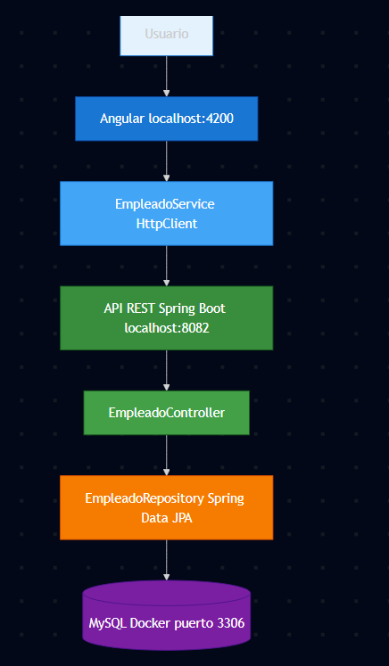
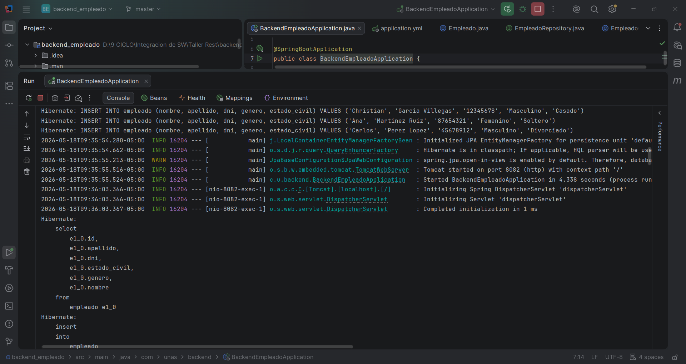
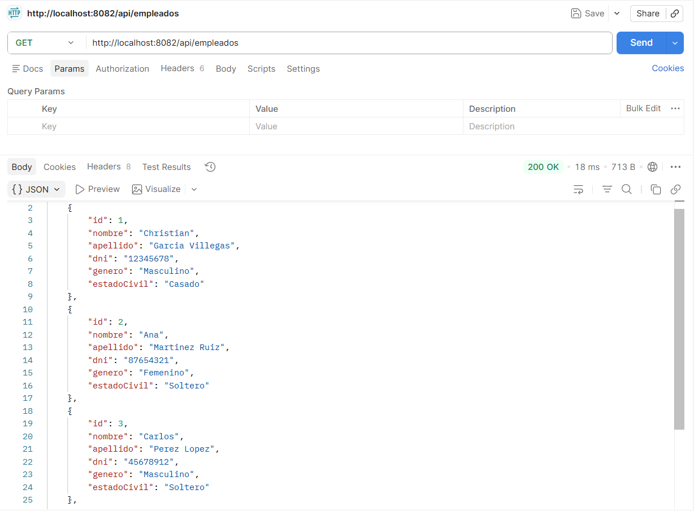
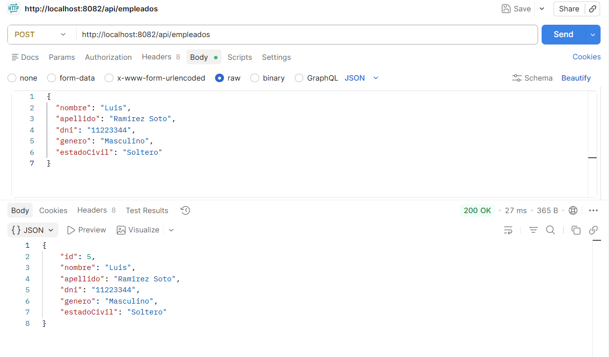
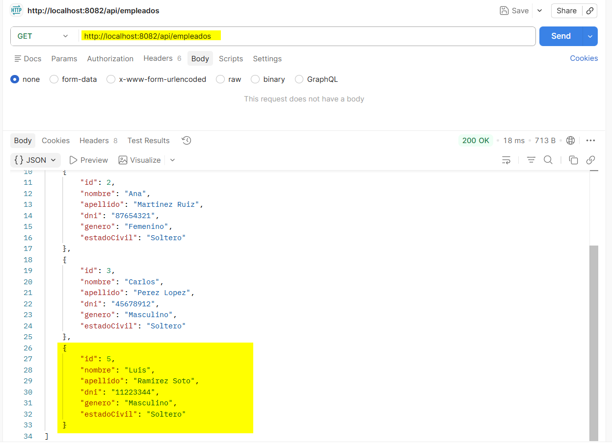
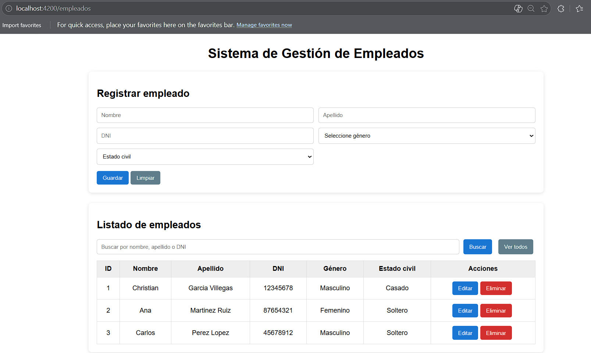
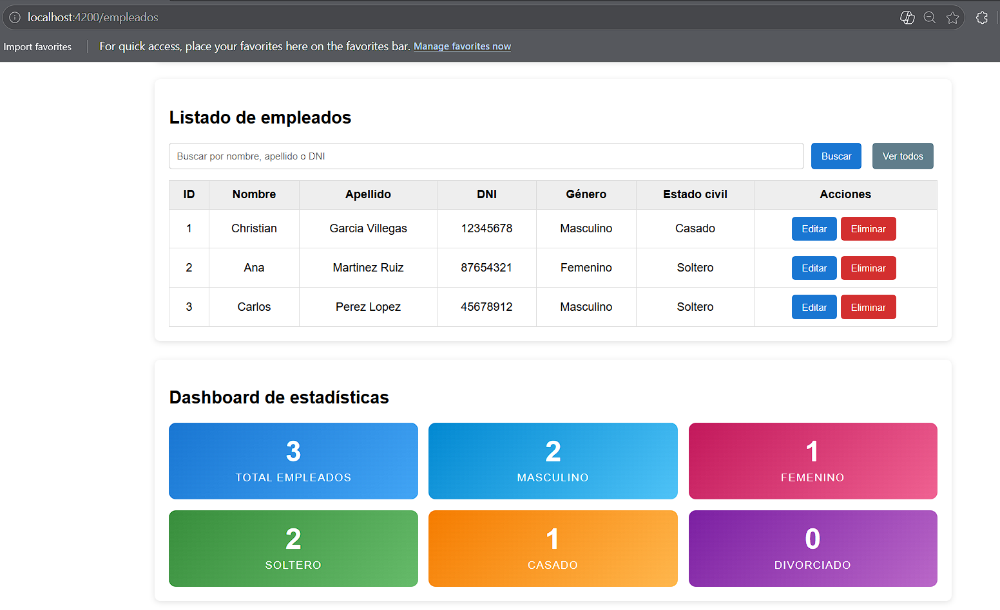

# Taller 07 — Sistema de Gestión de Empleados

Sistema web Full Stack desarrollado con Spring Boot, MySQL y Angular como parte del Taller Guiado 07 del curso de Integración de Software.

## Tecnologías

- Java 21 + Spring Boot 3.5
- Spring Data JPA / Hibernate
- MySQL 8.0 (Docker)
- Angular 20 + TypeScript
- Lombok

## Estructura del repositorio

```
taller-rest-iss/
├── backend_empleado/
└── frontend-empleado/
```

## Requisitos previos

- Java 21
- Maven
- Node.js y Angular CLI
- Docker

## Cómo ejecutar

**Base de datos**

```bash
docker run -d --name mysql-taller -e MYSQL_ROOT_PASSWORD=root -e MYSQL_DATABASE=db_taller -p 3306:3306 mysql:8.0
```

**Backend**

```bash
cd backend_empleado
mvn spring-boot:run
```

Disponible en: http://localhost:8082

**Frontend**

```bash
cd frontend-empleado
npm install
ng serve
```

Disponible en: http://localhost:4200

## Arquitectura



## Backend



## Pruebas de endpoints

GET — Listar empleados



POST — Registrar empleado



Verificación POST — GET tras registro



## Frontend





## Endpoints disponibles

| Método | Endpoint | Función |
|---|---|---|
| GET | /api/empleados | Lista todos los empleados |
| GET | /api/empleados/{id} | Busca por ID |
| GET | /api/empleados/buscar?texto= | Busca por nombre, apellido o DNI |
| POST | /api/empleados | Registra un empleado |
| PUT | /api/empleados/{id} | Actualiza un empleado |
| DELETE | /api/empleados/{id} | Elimina un empleado |

## Autor

jhurtadomi — Integración de Software 2026
